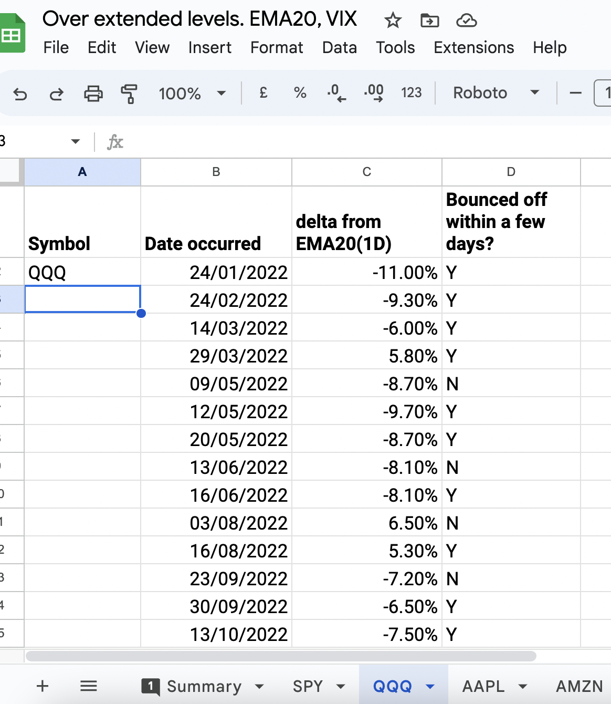
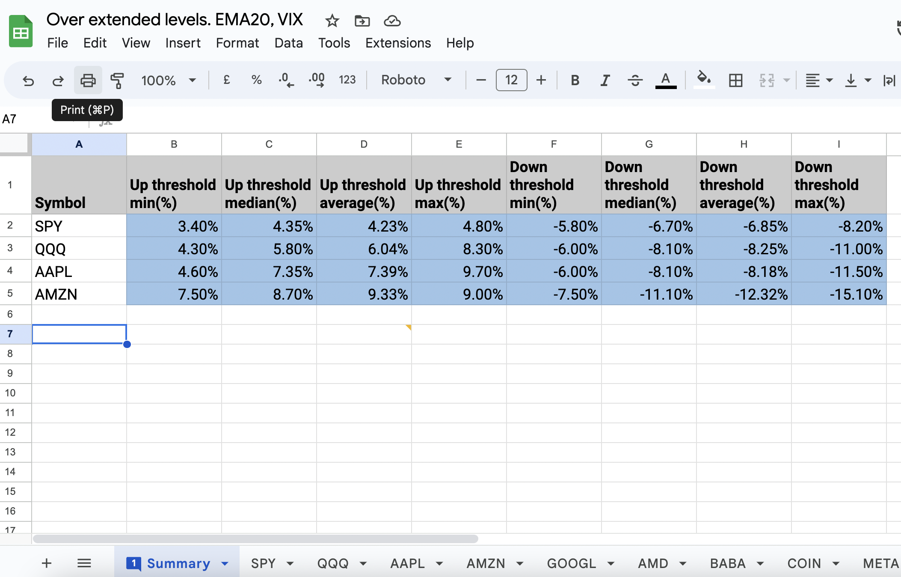

# How to contribute

## Overextended(positive & negative) levels from ema20
Overextended levels for certain stocks are tracked in this [sheet](https://docs.google.com/spreadsheets/d/1ERKDXZ5LbUG8Z4JPkm8MSrUR4UuGOYCv1AIRZweJQRQ/edit?usp=sharing)

1. See which symbols are recorded in `median_overextended_by_symbol` in `src/config/config.py`
2. Go to the [sheet](https://docs.google.com/spreadsheets/d/1ERKDXZ5LbUG8Z4JPkm8MSrUR4UuGOYCv1AIRZweJQRQ/edit?usp=sharing)
3. Fill in the data for the stock

4. Edit the summary to calculate the median overextended values

5. Fill the median value for the stock in `median_overextended_by_symbol` in `src/config/config.py`