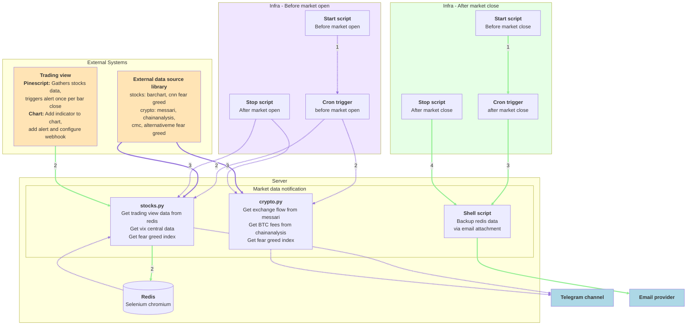

# Introduction
This repository sends stocks and crypto market data to channels like telegram

## Features
* Stocks telegram channel: https://t.me/+6RjlDOi8OyxkOGU1
  * Basic info such as closing price, EMA20, difference between closing price and EMA20
  * [Overextension from EMA20 based on the median delta when stock reverse in the next few days](https://github.com/hanchiang/market-data-notification/blob/master/CONTRIBUTING.md#overextendedpositive--negative-levels-from-ema20)
  * Highest volume in the past few consecutive days
  * Sudden large drop in VIX futures, or a decline for 5 consecutive days
  * Fear greed index
* Crypto telegram channel: https://t.me/+geTqFk8RktA2YzA9
  * BTC Exchange netflow, supply
  * BTC median trade intensity, fees
  * Fear greed index

# Tech Stack
* **Language**: Python 3.12+
* **Framework**: FastAPI
* **Database**: Redis (with Selenium chromium for browser automation)
* **Async HTTP**: aiohttp
* **Notifications**: python-telegram-bot
* **Job Scheduling**: Cron-based with custom time checking
* **Testing**: pytest, pytest-asyncio, coverage

# Project Structure

```
src/
├── config/              # Configuration management
│   └── config.py        # Environment variables and settings
├── data_source/         # External data source integrations
├── db/                  # Database layer
│   └── redis.py         # Redis connection and operations
├── dependencies.py      # Dependency injection container
├── event/               # Event emitter for async operations
├── http_client.py       # HTTP client wrapper
├── job/                 # Scheduled jobs
│   ├── stocks/          # Stock market notification jobs
│   │   ├── stocks.py    # Main stocks job entry point
│   │   ├── tradingview_message_sender.py
│   │   ├── vix_central_message_sender.py
│   │   └── sentiment_message_sender.py
│   ├── crypto/          # Crypto market notification jobs
│   │   ├── crypto.py    # Main crypto job entry point
│   │   ├── messari_message_sender.py
│   │   ├── chain_analysis_message_sender.py
│   │   ├── sentiment_message_sender.py
│   │   ├── top_coins_message_sender.py
│   │   └── top_sectors_message_sender.py
│   ├── job_wrapper.py   # Base class for all jobs
│   └── message_sender_wrapper.py
├── notification_destination/
│   └── telegram_notification.py  # Telegram bot integration
├── router/              # FastAPI route handlers
│   ├── tradingview/     # TradingView webhook endpoints
│   ├── messari/         # Messari API endpoints
│   ├── chainanalysis/   # ChainAnalysis API endpoints
│   ├── vix_central/     # VIX Central API endpoints
│   ├── barchart/        # Barchart API endpoints
│   ├── sentiment/       # Fear & Greed index endpoints
│   └── crypto_stats/    # Crypto statistics endpoints
├── service/             # Business logic layer
│   ├── stocks/
│   │   └── stocks_sentiment.py
│   ├── crypto/
│   │   ├── messari.py
│   │   ├── chainanalysis.py
│   │   ├── crypto_sentiment.py
│   │   └── crypto_stats.py
│   ├── tradingview_service.py
│   ├── vix_central.py
│   └── barchart.py
├── third_party_service/ # External API clients
│   ├── messari.py
│   ├── chainanalysis.py
│   ├── vix_central.py
│   └── barchart.py
├── type/                # Type definitions and data models
│   ├── market_data_type.py
│   ├── trading_view.py
│   ├── sentiment.py
│   ├── cmc.py
│   └── metric_type.py
├── util/                # Utility functions
│   ├── logger.py
│   ├── date_util.py
│   ├── exception.py
│   ├── my_telegram.py
│   └── context_manager.py
└── server.py            # FastAPI application setup
```

## Key Components

### 1. **API Server** (`server.py`)
- FastAPI application with REST endpoints
- Middleware for authentication, logging, and timing
- Health check endpoint
- Includes routers for all data sources

### 2. **Jobs** (`job/`)
- **StocksNotificationJob**: Runs before market open to send stock notifications
- **CryptoNotificationJob**: Runs twice daily (8:45 AM, 4:15 PM) to send crypto notifications
- **JobWrapper**: Base class handling Redis initialization, dependency injection, error handling, and Telegram notifications

### 3. **Services** (`service/`)
Business logic layer that processes data from third-party services:
- Transforms raw API responses into usable formats
- Performs calculations and data analysis
- Caches results in Redis when applicable

### 4. **Third Party Services** (`third_party_service/`)
Direct API clients for external data sources:
- Handle HTTP requests to external APIs
- Manage authentication and rate limiting
- Return raw data without processing

### 5. **Routers** (`router/`)
FastAPI endpoints organized by data source:
- TradingView webhook receiver
- Market data API endpoints (messari, chainanalysis, vix central, etc.)
- Sentiment data endpoints

### 6. **Dependencies** (`dependencies.py`)
Singleton dependency injection container that:
- Initializes all services on startup
- Manages HTTP client connections
- Provides centralized access to services

### 7. **Notification System** (`notification_destination/`)
- Telegram bot integration for sending messages
- Support for multiple channels (stocks, crypto, admin)
- Markdown formatting and message escaping

# Example Messages
See [example messages](examples/MESSAGES.md) for stocks and crypto notifications.

# Data Sources

## Stocks
* **TradingView**: Real-time stock data via webhook (price, EMA20, volume analysis)
* **VIX Central**: VIX futures data for market volatility tracking
* **Barchart**: Stock price history and technical indicators
* **CNN Fear & Greed Index**: Market sentiment indicator

## Crypto
* **Messari**: Exchange flow data, supply metrics
* **ChainAnalysis**: Transaction fees, median trade intensity
* **CoinMarketCap (CMC)**: Top gainers, trending coins, sector performance
* **Alternative.me**: Crypto Fear & Greed Index

# Workflow Overview

## Stocks Workflow (Purple Flow)
1. **When Market Closes** (Green Flow):
   - TradingView Pinescript triggers alert when bar closes
   - Webhook sends data to `/tradingview/daily-stocks` endpoint
   - Server receives and saves data to Redis

2. **Before Market Open** (Purple Flow):
   - Start script initializes server and dependencies
   - Cron trigger activates `stocks.py` job
   - Job retrieves TradingView data from Redis
   - Job fetches VIX Central data (volatility analysis)
   - Job fetches Fear & Greed Index
   - Sends formatted notification to Telegram stocks channel
   - Stop script shuts down server after market opens

## Crypto Workflow (Purple Flow)
1. **Twice Daily** (8:45 AM, 4:15 PM):
   - Start script initializes server and dependencies
   - Cron trigger activates `crypto.py` job
   - Job fetches real-time data from:
     - Messari (exchange flows, supply)
     - ChainAnalysis (fees, trade intensity)
     - CoinMarketCap (top coins, sectors)
     - Alternative.me (Fear & Greed Index)
   - Sends formatted notification to Telegram crypto channel
   - Stop script shuts down server

## Backup Workflow (Green Flow)
1. **After Market Close**:
   - Start script initializes
   - Cron trigger activates shell script
   - Script backs up Redis data
   - Sends backup via email attachment
   - Stop script completes

## Architecture Patterns

### Message Sender Pattern
Each notification type (e.g., TradingView, Messari) has its own message sender:
- Inherits from `MessageSenderWrapper`
- Implements `generate_message()` to format data
- Returns formatted message for Telegram

### Service Layer Pattern
- **Third Party Services**: Direct API clients (HTTP requests only)
- **Services**: Business logic, data transformation, caching
- **Dependencies**: Singleton container for service access

### Error Handling
- All jobs catch exceptions and send error notifications to admin channel
- Detailed logging with timestamps and context
- Redis and dependency cleanup in finally blocks



* purple flow: send notification before market open
* green flow: send notification, save tradingview data, backup redis data when market close

# Getting Started

## Prerequisites
- Python 3.12+
- Poetry (dependency management)
- Redis (local or remote instance)
- Docker (optional)

## Environment Setup

### Required Environment Variables
Create a `.env` file in the root directory:

```bash
# Environment
ENV=dev  # or prod

# Redis
REDIS_HOST=localhost
REDIS_PORT=6379
REDIS_DB=0

# Telegram
TELEGRAM_BOT_TOKEN=your_bot_token
TELEGRAM_STOCKS_CHAT_ID=your_stocks_channel_id
TELEGRAM_CRYPTO_CHAT_ID=your_crypto_channel_id
TELEGRAM_ADMIN_CHAT_ID=your_admin_channel_id

# API Authentication
API_AUTH_TOKEN=your_secret_token

# Job Configuration
STOCKS_JOB_START_LOCAL_HOUR=9
STOCKS_JOB_START_LOCAL_MINUTE=0
CRYPTO_JOB_START_LOCAL_HOURS=8,16
CRYPTO_JOB_START_LOCAL_MINUTES=45,15

# Testing
IS_TESTING_TELEGRAM=false
```

## Installation

### Option 1: Local Development (No Docker)

1. **Install Python 3.12+**
   ```bash
   # Download from https://www.python.org/downloads/
   python --version  # Verify installation
   ```

2. **Install Poetry**
   ```bash
   curl -sSL https://install.python-poetry.org | python3 -
   # Or visit: https://python-poetry.org/docs/
   ```

3. **Install Dependencies**
   ```bash
   poetry install
   ```

4. **Start Redis**
   ```bash
   redis-server
   ```

5. **Run the Server**
   ```bash
   poetry run python main.py
   ```

6. **Run Jobs Manually**
   ```bash
   # Stocks job (force run in test mode)
   ENV=dev poetry run python src/job/stocks/stocks.py --force_run=1 --test_mode=1
   
   # Crypto job (force run in test mode)
   ENV=dev poetry run python src/job/crypto/crypto.py --force_run=1 --test_mode=1
   ```

### Option 2: Docker

1. **Install Docker**
   ```bash
   # Visit: https://docs.docker.com/engine/install/
   ```

2. **Start Services**
   ```bash
   docker-compose up -d
   ```

3. **Run Jobs in Container**
   ```bash
   # Stocks job
   docker exec -it market_data_notification sh -c "ENV=dev poetry run python src/job/stocks/stocks.py --force_run=1 --test_mode=1"
   
   # Crypto job
   docker exec -it market_data_notification sh -c "ENV=dev poetry run python src/job/crypto/crypto.py --force_run=1 --test_mode=1"
   ```

## Testing

### Run Tests
```bash
# Run all tests
poetry run pytest

# Run with coverage
poetry run coverage run --branch -m pytest

# Generate coverage report
poetry run coverage report --show-missing

# HTML coverage report
poetry run coverage html
```

### Testing TradingView Webhook

**Note**: Webhooks require HTTPS URLs, so localhost won't work directly.

1. **Use a Reverse Proxy (ngrok)**
   ```bash
   ngrok http 8080
   ```

2. **Configure Test Mode**
   Set in `.env`:
   ```bash
   IS_TESTING_TELEGRAM=true
   ```
   
   This will:
   - Save data to a dev key in Redis
   - Send notifications to dev Telegram channels

3. **Configure TradingView Alert**
   - Use the ngrok HTTPS URL as webhook URL
   - Format: `https://your-ngrok-url.ngrok.io/tradingview/daily-stocks`

## API Endpoints

Once the server is running, access the API documentation:
- **Swagger UI**: http://localhost:8080/docs
- **ReDoc**: http://localhost:8080/redoc

### Key Endpoints
- `POST /tradingview/daily-stocks` - Receive TradingView webhook data
- `GET /messari/asset-metrics?symbol=BTC` - Get Messari metrics
- `GET /chainanalysis/fees?symbol=BTC` - Get transaction fees
- `GET /vixcentral/recent-values` - Get VIX futures data
- `GET /sentiment/crypto-fear-greed` - Get crypto sentiment
- `GET /sentiment/stocks-fear-greed` - Get stocks sentiment
- `GET /crypto_stats/topsectors` - Get top crypto sectors
- `GET /healthz` - Health check

## Development Tips

### Job Arguments
- `--force_run=1`: Force job to run regardless of schedule
- `--test_mode=1`: Run in test mode (uses dev channels, relaxed thresholds)

### Code Quality
```bash
# Format code with black
poetry run black src/

# Lint with ruff
poetry run ruff check src/

# Type checking with mypy
poetry run mypy src/
```

### Debugging
- Logs are output to console with timestamps
- Check Redis data: `redis-cli` then `KEYS *`
- Telegram admin channel receives error notifications

# Contributing

We welcome contributions! Here's how to get started:

## Development Workflow

1. **Fork and Clone**
   ```bash
   git clone https://github.com/YOUR_USERNAME/market-data-notification.git
   cd market-data-notification
   ```

2. **Create a Branch**
   ```bash
   git checkout -b feature/your-feature-name
   ```

3. **Make Changes**
   - Follow existing code patterns
   - Add tests for new features
   - Update documentation

4. **Test Your Changes**
   ```bash
   poetry run pytest
   poetry run black src/
   poetry run ruff check src/
   ```

5. **Commit and Push**
   ```bash
   git add .
   git commit -m "feat: add your feature description"
   git push origin feature/your-feature-name
   ```

6. **Create Pull Request**
   - Describe your changes clearly
   - Reference any related issues
   - Ensure CI checks pass

## Code Guidelines

- Use **type hints** for function parameters and returns
- Write **docstrings** for complex functions
- Keep functions **small and focused** (single responsibility)
- Use **async/await** for I/O operations
- Handle **exceptions** appropriately with logging
- Follow **PEP 8** style guide (enforced by black)

## Adding New Data Sources

1. **Create Third Party Service** (`src/third_party_service/`)
   - Handle raw API requests
   - Return unprocessed data

2. **Create Service** (`src/service/`)
   - Transform and process data
   - Implement business logic
   - Add caching if needed

3. **Add to Dependencies** (`src/dependencies.py`)
   - Initialize in `build()` method
   - Add cleanup in `cleanup()` method
   - Add getter method

4. **Create Router** (`src/router/`)
   - Add FastAPI endpoints
   - Include router in `server.py`

5. **Create Message Sender** (`src/job/`)
   - Extend `MessageSenderWrapper`
   - Implement `generate_message()`
   - Format data for Telegram

6. **Add Tests**
   - Unit tests in `tests/unit/`
   - Test data in `tests/data/`

See [CONTRIBUTING.md](CONTRIBUTING.md) for detailed contribution guidelines.

# CI/CD

## GitHub Actions Workflows

- **Test**: Runs on every push and PR
- **Deploy**: Deploys to production on merge to master
- **Deploy Cron Stocks**: Deploys stocks job scheduler
- **Deploy Cron Crypto**: Deploys crypto job scheduler
- **Deploy Email Backup**: Deploys backup job

## Deployment

The project uses GitHub Actions for automated deployment. Ensure these secrets are configured:
- `API_AUTH_TOKEN`
- `TELEGRAM_BOT_TOKEN`
- `TELEGRAM_*_CHAT_ID` (for each channel)
- Redis connection details

# Roadmap

## Current Features ✅
- Real-time stock and crypto market notifications
- TradingView webhook integration
- Multiple data source aggregation
- Telegram channel notifications
- Redis data caching and backup
- FastAPI REST API
- Scheduled jobs with cron

## Planned Features 🚧
- [ ] API to send custom messages to Telegram channels
- [ ] Enhanced Redis data backup automation
- [ ] Code coverage reporting in GitHub Actions
- [ ] Interactive Telegram bot with menu commands
- [ ] Structured logging with log levels and rotation
- [ ] Barchart stock price caching optimization
- [ ] Web dashboard for monitoring
- [ ] Webhook retry mechanism with exponential backoff
- [ ] Historical data analysis and trends
- [ ] Customizable alert thresholds per user

# Troubleshooting

## Common Issues

### Redis Connection Failed
```bash
# Check if Redis is running
redis-cli ping
# Should return "PONG"

# Start Redis if needed
redis-server
```

### Telegram Bot Not Sending Messages
- Verify `TELEGRAM_BOT_TOKEN` is correct
- Check bot has permission to post in channels
- Ensure channel IDs are correct (use negative IDs for channels)

### Job Not Running
- Check `force_run` and `test_mode` flags
- Verify job start time configuration
- Check logs for errors: `docker logs market_data_notification`

### Import Errors
```bash
# Reinstall dependencies
poetry install --no-cache
```


## 📝 License

This project is licensed under the MIT License - see the LICENSE file for details.

# Contact

- **Issues**: [GitHub Issues](https://github.com/hanchiang/market-data-notification/issues)
- **Telegram Channels**: 
  - Stocks: https://t.me/+6RjlDOi8OyxkOGU1
  - Crypto: https://t.me/+geTqFk8RktA2YzA9