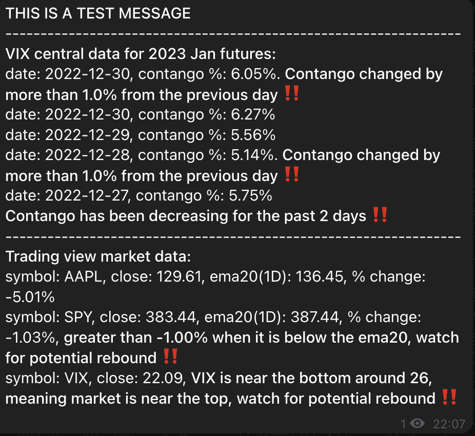
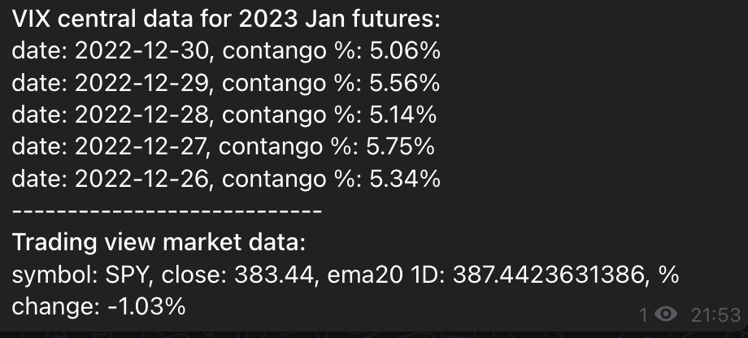

# Introduction
This repository sends market data notification to channels like telegram. Data sources are trading view and vix central.

# Tech stack
* Language: Python
* Framework: FastAPI

# Sample
## Test message

## Simulate real message
