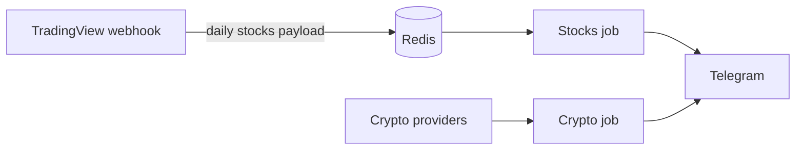

# Market Data Notification Backend

FastAPI backend and scheduled job runner for stock and crypto Telegram notifications.

- Stocks channel: https://t.me/+6RjlDOi8OyxkOGU1
- Crypto channel: https://t.me/+geTqFk8RktA2YzA9
- Example outputs: [examples/MESSAGES.md](examples/MESSAGES.md)

## Features

### Stocks

- Daily TradingView webhook ingestion for market-close payloads
- Telegram summaries with close price, EMA20 distance, volume context, VIX context, and sentiment
- Redis-backed replay workflow for local testing and debugging

### Crypto

- Scheduled Telegram digest with sentiment, sector breadth, and standout-coin context
- Aggregation across multiple external providers in one notification flow
- Phase-1 crypto signal history, scoring, and operator-only reporting from stored snapshots
- Backend-specific orchestration over provider adapters, with unofficial or privacy-sensitive provider contracts expected to come from `market-data-library`

## What It Does

- Receives TradingView webhook payloads and stores them in Redis for later stock notifications
- Runs scheduled stock and crypto jobs that fetch market data, format messages, and send them to Telegram
- Uses Redis for transient state and local replay workflows
- Installs a cron-backed Redis backup email flow that sends the archive through Resend using a hosted transactional template
- Supports local test-mode routing to dev Telegram channels

## Flow Overview


```mermaid
flowchart LR
    TV[TradingView webhook]
    Redis[(Redis)]
    StocksJob[Stocks job]
    CryptoProviders[Crypto providers]
    CryptoJob[Crypto job]
    Telegram[Telegram]

    TV -->|daily stocks payload| Redis
    Redis --> StocksJob
    StocksJob --> Telegram
    CryptoProviders --> CryptoJob
    CryptoJob --> Telegram
```

## Main Flows

### Stocks

1. TradingView posts daily data to `POST /tradingview/daily-stocks`
2. The backend validates and stores production payloads in Redis
3. The stock job reads Redis data, adds VIX and sentiment context, and sends Telegram output before market open

### Crypto

1. The crypto job fetches data from external providers
2. The job formats a digest-oriented crypto summary
3. The backend sends the result to the crypto Telegram channel
4. The phase-1 signal path persists normalized snapshots and sends a separate private/admin operator digest when enabled

## Key Paths

```text
src/server.py                            FastAPI app startup and router wiring
src/router/tradingview/tradingview.py    TradingView webhook ingress
src/service/tradingview_service.py       TradingView Redis storage and retrieval
src/job/stocks/stocks.py                 Stock notification entry point
src/job/crypto/crypto.py                 Crypto notification entry point
src/job/crypto/crypto_digest_message_sender.py
src/job/crypto/crypto_digest_formatter.py
src/job/crypto/crypto_signal_report.py   Local crypto signal report entry point
src/service/crypto_signal/               Crypto signal persistence and scoring
src/notification_destination/telegram_notification.py
src/config/config.py                     Environment contract
tests/unit/                              Main unit test surface
sample-data/                             TradingView replay payloads
scripts/                                 Local helper scripts
```

## Data Sources

### Stocks

- TradingView
- VIX Central
- Barchart
- CNN Fear & Greed

### Crypto

- CryptoQuant via `market-data-library` for manual Basic-plan-compatible `price-ohlcv` checks
- CoinMarketCap
- Alternative.me Fear & Greed

## Setup

### Prerequisites

- Python 3.12+
- Poetry
- Redis
- Docker for container-based local runs
- GitHub SSH access to the private `market-data-library` dependency for non-Docker installs

### Environment

Create `.env` in the repo root. The canonical env contract lives in [src/config/config.py](src/config/config.py).

Common variables:

```bash
ENV=dev
REDIS_HOST=localhost
REDIS_PORT=6379
REDIS_DB=0

STOCKS_TELEGRAM_BOT_TOKEN=...
STOCKS_TELEGRAM_CHANNEL_ID=...
STOCKS_TELEGRAM_ADMIN_BOT_TOKEN=...
STOCKS_TELEGRAM_ADMIN_ID=...
STOCKS_TELEGRAM_DEV_BOT_TOKEN=...
STOCKS_TELEGRAM_DEV_ID=...

CRYPTO_TELEGRAM_BOT_TOKEN=...
CRYPTO_TELEGRAM_CHANNEL_ID=...
CRYPTO_TELEGRAM_ADMIN_BOT_TOKEN=...
CRYPTO_TELEGRAM_ADMIN_ID=...
CRYPTO_TELEGRAM_DEV_BOT_TOKEN=...
CRYPTO_TELEGRAM_DEV_ID=...
# Used by the optional manual CryptoQuant `price-ohlcv` route.
CRYPTOQUANT_API_TOKEN=...

CRYPTO_SIGNAL_DB_PATH=var/crypto_signal/crypto_signal.sqlite3
# Optional test-mode override. Defaults to var/crypto_signal/crypto_signal.test.sqlite3.
CRYPTO_SIGNAL_TEST_DB_PATH=var/crypto_signal/crypto_signal.test.sqlite3
# Optional private/operator signal recipient. Defaults to CRYPTO_TELEGRAM_ADMIN_ID.
CRYPTO_SIGNAL_RECIPIENT_ID=...
CRYPTO_SIGNAL_TRACKED_UNIVERSE=BTC,ETH,SOL
CRYPTO_SIGNAL_WATCHLIST=
CRYPTO_SIGNAL_DYNAMIC_CANDIDATE_MIN_PRICE_USD=0
CRYPTO_SIGNAL_DYNAMIC_CANDIDATE_MIN_VOLUME_24H=50000000

API_AUTH_TOKEN=...
TRADING_VIEW_WEBHOOK_SECRET=...
CNN_PAGE_LOAD_TIMEOUT_SECONDS=45
TELEGRAM_CONNECT_TIMEOUT_SECONDS=20
TELEGRAM_READ_TIMEOUT_SECONDS=20
TELEGRAM_WRITE_TIMEOUT_SECONDS=20
TELEGRAM_POOL_TIMEOUT_SECONDS=5
```

`CRYPTO_SIGNAL_DB_PATH` is relative to the backend process working directory
when left as the default. In production that default resolves inside the app
container under `/app/var/crypto_signal/crypto_signal.sqlite3`. The production
deploy mounts that directory to persistent host storage under
`market_data_notification_jobs/crypto_signal` so signal history survives
container replacement.

## Local Development

### Option 1: Local Python

```bash
poetry install
```

`poetry install` pulls `market-data-library` from Git over SSH, so the machine must have access to `git@github.com:hanchiang/market_data_api.git`.
Use the sibling workspace override only when backend validation must exercise unpublished local `market-data-library` changes.
The override script installs the sibling repo as an editable package in the backend Poetry environment, so rerun it after `poetry install` if Poetry restores the git dependency.

Switch to the sibling workspace copy of `market-data-library` when needed:

```bash
./scripts/use_local_market_data_library.sh
```

Switch back to the Git dependency:

```bash
./scripts/use_git_market_data_library.sh
```

Confirm which source the backend currently imports before running validation:

```bash
./scripts/show_market_data_library_source.sh
```

Run the backend:

```bash
redis-server
poetry run python main.py
```

Host-side Python runs can still use local Selenium mode if you explicitly set
`SELENIUM_REMOTE_MODE=false` and have Chrome plus ChromeDriver available on
your machine. That is no longer the default local workflow.
Use `CNN_PAGE_LOAD_TIMEOUT_SECONDS` to tune the Selenium page-load bound for
the CNN Fear & Greed scraper when provider latency changes; the default is `45`.

Run jobs manually:

```bash
ENV=dev poetry run python -m src.job.stocks.stocks --force_run=1 --test_mode=1
ENV=dev poetry run python -m src.job.crypto.crypto --force_run=1 --test_mode=1
```

`--test_mode=1` now builds an explicit runtime mode for dev Telegram routing,
schedule bypass, stale replay allowance, and relaxed thresholds. You do not need
to set a separate startup flag for those local test runs.

If you invoke the job files directly instead of using `python -m`, add the repo root to `PYTHONPATH` first:

```bash
PYTHONPATH="$(pwd)" ENV=dev poetry run python src/job/stocks/stocks.py --force_run=1 --test_mode=1
PYTHONPATH="$(pwd)" ENV=dev poetry run python src/job/crypto/crypto.py --force_run=1 --test_mode=1
```

### Crypto Signal Phase 1

The crypto signal feature keeps the public crypto digest unchanged while adding
SQLite-backed history, deterministic scoring, and a separate operator-only
signal digest. Phase 1 must stay on private/admin routing; the signal path
rejects `CRYPTO_TELEGRAM_CHANNEL_ID` as a destination.

Render the latest stored signal report without sending Telegram:

```bash
ENV=dev PYTHONPATH="$(pwd)" poetry run python src/job/crypto/crypto_signal_report.py --window 7d --limit 3 --send_telegram=0 --test_mode=1
```

Send the rendered report only after confirming the configured signal recipient
is private:

```bash
ENV=dev PYTHONPATH="$(pwd)" poetry run python src/job/crypto/crypto_signal_report.py --window 7d --limit 3 --send_telegram=1 --test_mode=1
```

For the full operator procedure, see the workspace runbook:
https://github.com/hanchiang/market-data-workspace/blob/master/docs/runbooks/crypto-signal-phase-1.md

### Option 2: Docker

Create the build secret used by Dockerfiles:

```bash
mkdir -p secret
printf '%s' "$GITHUB_TOKEN_WITH_REPO_ACCESS" > secret/github_token
```

Start the local stack:

```bash
docker compose up -d
```

The compose backend enables remote Selenium and points CNN fear/greed scraping at the `chrome` container.
The backend image does not bundle Chrome or ChromeDriver; local browser mode is only for host-side Python runs with your own local browser installed.
By default, Docker still uses the released git-pinned `market-data-library` package installed into the image during `poetry install`.
If you need the backend container to import the sibling workspace checkout instead, uncomment the documented `../market-data-library` bind mount plus `PYTHONPATH` override in [docker-compose.yml](docker-compose.yml) before recreating the backend container.

Run jobs in the backend container:

```bash
docker exec -it market_data_notification sh -c "ENV=dev poetry run python -m src.job.stocks.stocks --force_run=1 --test_mode=1"
docker exec -it market_data_notification sh -c "ENV=dev poetry run python -m src.job.crypto.crypto --force_run=1 --test_mode=1"
```

## Testing And Validation

Preferred checks:

```bash
uv run ruff check .
uv run python -m compileall src tests main.py
uv run pytest tests/unit
```

If you are staying on the Poetry workflow instead of `uv`, the equivalent commands still work via `poetry run`.

## TradingView Replay

Localhost cannot receive TradingView HTTPS webhooks directly. Use a reverse proxy such as `ngrok` when testing live webhook delivery:

```bash
ngrok http 8080
```

Sample TradingView payloads are available in:

- `sample-data/stocks.json`
- `sample-data/economy-indicator.json`

Load them into the local Docker Redis instance:

```bash
docker compose up -d redis
bash scripts/import_tradingview_sample_data_to_redis.sh
```

Production ignores TradingView webhook requests that set `test_mode=true`, so replay payloads are for local or non-production debugging only.

By default that imports into:

- `tradingview-stocks`
- `tradingview-economy_indicator`

Show script help:

```bash
bash scripts/import_tradingview_sample_data_to_redis.sh --help
```

If you want TradingView itself to post into the backend, configure the webhook URL as:

```text
https://<your-ngrok-domain>/tradingview/daily-stocks
```

When you run the stocks job with `--test_mode=1`, the volume-alert checks are intentionally easier to trigger for local visual review:

- `NUM_PAST_DAYS_RANGE_STOCKS_VOLUME_RANK` defaults to `2,5` in test mode instead of `5,30`
- `STOCKS_VOLUME_ALERT_RATIO_THRESHOLD` defaults to `0.05` in test mode instead of `0.2`

That keeps the alert logic honest while making old replay snapshots more likely to show at least one volume alert during Telegram screenshot testing. If you need exact behavior, set those env vars explicitly before running the job.

## API

When the server is running:

- Swagger UI: http://localhost:8080/docs
- ReDoc: http://localhost:8080/redoc
- Health check: `GET /healthz`

In production, only `GET /healthz` and `POST /tradingview/daily-stocks` are
public. Swagger UI, ReDoc, OpenAPI, and all other routes stay behind
`X-Api-Auth`.

Important endpoints:

- `POST /tradingview/daily-stocks`
- `GET /vixcentral/recent-values`
- `GET /sentiment/crypto-fear-greed`
- `GET /sentiment/stocks-fear-greed`
- `GET /crypto_stats/topsectors`

## Troubleshooting

### Redis

```bash
redis-cli ping
docker logs redis
```

### Telegram

- Verify bot tokens and chat IDs
- Check the admin Telegram channel for runtime error notifications
- Confirm whether the job was started with `--test_mode=1` when you expect dev-channel routing

### Jobs

- Check `--force_run` and `--test_mode`
- Check backend logs: `docker logs market_data_notification`
- Inspect Redis keys and latest entries with `redis-cli`

## Related Docs

- Contribution and implementation notes: [CONTRIBUTING.md](CONTRIBUTING.md)
- Example messages: [examples/MESSAGES.md](examples/MESSAGES.md)
- Workspace design note on test-mode runtime state: [../docs/design/test-mode-runtime-state.md](../docs/design/test-mode-runtime-state.md)
- Workspace trace for local TradingView replay: [../docs/traces/2026-03-26-local-backend-testing-dev-telegram.md](../docs/traces/2026-03-26-local-backend-testing-dev-telegram.md)

## CI And Deployment

- GitHub Actions is the canonical build and deploy path
- Pushes to `master` publish the release image tagged by commit SHA
- The repo also contains local recovery helpers for manual image publishing when needed

## License

MIT. See [LICENSE](LICENSE).
