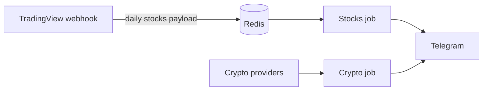

# Market Data Notification Backend

FastAPI backend and scheduled job runner for stock and crypto Telegram notifications.

- Stocks channel: https://t.me/+6RjlDOi8OyxkOGU1
- Crypto channel: https://t.me/+geTqFk8RktA2YzA9
- Example outputs: [examples/MESSAGES.md](examples/MESSAGES.md)

## Features

### Stocks

- Daily TradingView webhook ingestion for market-close payloads
- Telegram summaries with close price, EMA20 distance, volume context, VIX context, and sentiment
- Redis-backed replay workflow for local testing and debugging

### Crypto

- Scheduled Telegram summaries for exchange flow, fees, trade intensity, sentiment, top coins, and sectors
- Aggregation across multiple external providers in one notification flow

## What It Does

- Receives TradingView webhook payloads and stores them in Redis for later stock notifications
- Runs scheduled stock and crypto jobs that fetch market data, format messages, and send them to Telegram
- Uses Redis for transient state and local replay workflows
- Supports local test-mode routing to dev Telegram channels

## Flow Overview


```mermaid
flowchart LR
    TV[TradingView webhook]
    Redis[(Redis)]
    StocksJob[Stocks job]
    CryptoProviders[Crypto providers]
    CryptoJob[Crypto job]
    Telegram[Telegram]

    TV -->|daily stocks payload| Redis
    Redis --> StocksJob
    StocksJob --> Telegram
    CryptoProviders --> CryptoJob
    CryptoJob --> Telegram
```

## Main Flows

### Stocks

1. TradingView posts daily data to `POST /tradingview/daily-stocks`
2. The backend validates and stores the payload in Redis
3. The stock job reads Redis data, adds VIX and sentiment context, and sends Telegram output before market open

### Crypto

1. The crypto job fetches data from external providers
2. The job formats summaries for fees, flows, sentiment, top coins, and sectors
3. The backend sends the result to the crypto Telegram channel

## Key Paths

```text
src/server.py                            FastAPI app startup and router wiring
src/router/tradingview/tradingview.py    TradingView webhook ingress
src/service/tradingview_service.py       TradingView Redis storage and retrieval
src/job/stocks/stocks.py                 Stock notification entry point
src/job/crypto/crypto.py                 Crypto notification entry point
src/notification_destination/telegram_notification.py
src/config/config.py                     Environment contract
tests/unit/                              Main unit test surface
sample-data/                             TradingView replay payloads
scripts/                                 Local helper scripts
```

## Data Sources

### Stocks

- TradingView
- VIX Central
- Barchart
- CNN Fear & Greed

### Crypto

- Messari
- Chainanalysis
- CoinMarketCap
- Alternative.me Fear & Greed

## Setup

### Prerequisites

- Python 3.12+
- Poetry
- Redis
- Docker for container-based local runs
- GitHub SSH access to the private `market-data-library` dependency for non-Docker installs

### Environment

Create `.env` in the repo root. The canonical env contract lives in [src/config/config.py](src/config/config.py).

Common variables:

```bash
ENV=dev
REDIS_HOST=localhost
REDIS_PORT=6379
REDIS_DB=0

STOCKS_TELEGRAM_BOT_TOKEN=...
STOCKS_TELEGRAM_CHANNEL_ID=...
STOCKS_TELEGRAM_ADMIN_BOT_TOKEN=...
STOCKS_TELEGRAM_ADMIN_ID=...
STOCKS_TELEGRAM_DEV_BOT_TOKEN=...
STOCKS_TELEGRAM_DEV_ID=...

CRYPTO_TELEGRAM_BOT_TOKEN=...
CRYPTO_TELEGRAM_CHANNEL_ID=...
CRYPTO_TELEGRAM_ADMIN_BOT_TOKEN=...
CRYPTO_TELEGRAM_ADMIN_ID=...
CRYPTO_TELEGRAM_DEV_BOT_TOKEN=...
CRYPTO_TELEGRAM_DEV_ID=...

API_AUTH_TOKEN=...
TRADING_VIEW_WEBHOOK_SECRET=...

IS_TESTING_TELEGRAM=false
USE_TRADINGVIEW_DEV_REDIS_KEYS=false
```

## Local Development

### Option 1: Local Python

```bash
poetry install
```

`poetry install` pulls `market-data-library` from Git over SSH, so the machine must have access to `git@github.com:hanchiang/market_data_api.git`.

Switch to the sibling workspace copy of `market-data-library` when needed:

```bash
./scripts/use_local_market_data_library.sh
```

Switch back to the Git dependency:

```bash
./scripts/use_git_market_data_library.sh
```

Run the backend:

```bash
redis-server
poetry run python main.py
```

Run jobs manually:

```bash
ENV=dev poetry run python -m src.job.stocks.stocks --force_run=1 --test_mode=1
ENV=dev poetry run python -m src.job.crypto.crypto --force_run=1 --test_mode=1
```

If you invoke the job files directly instead of using `python -m`, add the repo root to `PYTHONPATH` first:

```bash
PYTHONPATH="$(pwd)" ENV=dev poetry run python src/job/stocks/stocks.py --force_run=1 --test_mode=1
PYTHONPATH="$(pwd)" ENV=dev poetry run python src/job/crypto/crypto.py --force_run=1 --test_mode=1
```

### Option 2: Docker

Create the build secret used by Dockerfiles:

```bash
mkdir -p secret
printf '%s' "$GITHUB_TOKEN_WITH_REPO_ACCESS" > secret/github_token
```

Start the local stack:

```bash
docker compose up -d
```

The compose backend enables remote Selenium and points CNN fear/greed scraping at the `chrome` container.

Run jobs in the backend container:

```bash
docker exec -it market_data_notification sh -c "ENV=dev poetry run python -m src.job.stocks.stocks --force_run=1 --test_mode=1"
docker exec -it market_data_notification sh -c "ENV=dev poetry run python -m src.job.crypto.crypto --force_run=1 --test_mode=1"
```

## Testing And Validation

Preferred checks:

```bash
uv run ruff check .
uv run python -m compileall src tests main.py
uv run pytest tests/unit
```

If you are staying on the Poetry workflow instead of `uv`, the equivalent commands still work via `poetry run`.

## TradingView Replay

Localhost cannot receive TradingView HTTPS webhooks directly. Use a reverse proxy such as `ngrok` when testing live webhook delivery:

```bash
ngrok http 8080
```

Sample TradingView payloads are available in:

- `sample-data/stocks.json`
- `sample-data/economy-indicator.json`

Load them into the local Docker Redis instance:

```bash
docker compose up -d redis
bash scripts/import_tradingview_sample_data_to_redis.sh
```

By default that imports into:

- `tradingview-stocks`
- `tradingview-economy_indicator`

Use legacy `-dev` key names only when you explicitly want suffix-based isolation in the same Redis instance:

```bash
bash scripts/import_tradingview_sample_data_to_redis.sh --mode dev
```

Show script help:

```bash
bash scripts/import_tradingview_sample_data_to_redis.sh --help
```

If you want TradingView itself to post into the backend, configure the webhook URL as:

```text
https://<your-ngrok-domain>/tradingview/daily-stocks
```

## API

When the server is running:

- Swagger UI: http://localhost:8080/docs
- ReDoc: http://localhost:8080/redoc
- Health check: `GET /healthz`

Important endpoints:

- `POST /tradingview/daily-stocks`
- `GET /messari/asset-metrics?symbol=BTC`
- `GET /chainanalysis/fees?symbol=BTC`
- `GET /vixcentral/recent-values`
- `GET /sentiment/crypto-fear-greed`
- `GET /sentiment/stocks-fear-greed`
- `GET /crypto_stats/topsectors`

## Troubleshooting

### Redis

```bash
redis-cli ping
docker logs redis
```

### Telegram

- Verify bot tokens and chat IDs
- Check the admin Telegram channel for runtime error notifications
- Confirm whether `IS_TESTING_TELEGRAM` is routing sends to dev channels
- Confirm whether `USE_TRADINGVIEW_DEV_REDIS_KEYS` is intentionally enabled before expecting `-dev` TradingView Redis keys

### Jobs

- Check `--force_run` and `--test_mode`
- Check backend logs: `docker logs market_data_notification`
- Inspect Redis keys and latest entries with `redis-cli`

## Related Docs

- Contribution and implementation notes: [CONTRIBUTING.md](CONTRIBUTING.md)
- Example messages: [examples/MESSAGES.md](examples/MESSAGES.md)
- Workspace design note on test-mode runtime state: [../docs/design/test-mode-runtime-state.md](../docs/design/test-mode-runtime-state.md)
- Workspace trace for local TradingView replay: [../docs/traces/2026-03-26-local-backend-testing-dev-telegram.md](../docs/traces/2026-03-26-local-backend-testing-dev-telegram.md)

## CI And Deployment

- GitHub Actions is the canonical build and deploy path
- Pushes to `master` publish the release image tagged by commit SHA
- The repo also contains local recovery helpers for manual image publishing when needed

## License

MIT. See [LICENSE](LICENSE).
