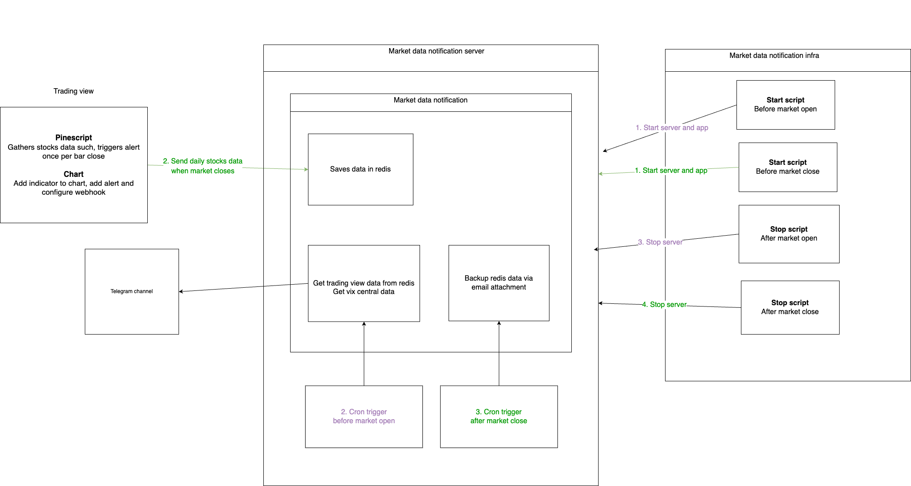

# Introduction
This repository sends stocks and crypto market data to channels like telegram

## Features
* Stocks
  * Basic info such as closing price, EMA20, difference between closing price and EMA20
  * [Overextension from EMA20 based on the median delta when stock reverse in the next few days](https://github.com/hanchiang/market-data-notification/blob/master/CONTRIBUTING.md#overextendedpositive--negative-levels-from-ema20)
  * Sudden large drop in VIX futures, or a decline for 5 consecutive days
* Crypto
  * BTC Exchange netflow, supply, median trade intensity, fees

# Tech stack
* Language: Python
* Framework: FastAPI
* Database: Redis

# Structure
* `src`
  * `server`: API server
  * `service`: For retrieving data from various sources
  * `job`: Scheduled jobs that sends stocks and crypto notification

# Example message for stocks
## Test message

## Actual message

# Example message for crypto
## Actual message

# How to do local development
* Use a reverse prxoy like [ngrok](https://ngrok.com/)
* Set is_testing_telegram to TRUE, which will save data to a dev key in redis and send notification to a dev telegram channel

# Stocks cron workflow
* Receive market data when market closes -> save in redis
* Scheduled job before market open -> Send notification to telegram

# Crypto cron workflow
* Scheduled job send notification to telegram

# Common cron workflow
* Send redis data via email

# Contributing
See [CONTRIBUTING](CONTRIBUTING.md)

# TODO
* Common cron: send attachment in email
* Test
* Bot with pre-defined menu for user interaction
* Get overextended levels using google sheet API instead of manually entering them.