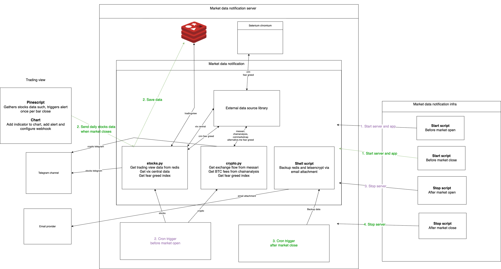

# Introduction
This repository sends stocks and crypto market data to channels like telegram

## Features
* Stocks telegram channel: https://t.me/+6RjlDOi8OyxkOGU1
  * Basic info such as closing price, EMA20, difference between closing price and EMA20
  * [Overextension from EMA20 based on the median delta when stock reverse in the next few days](https://github.com/hanchiang/market-data-notification/blob/master/CONTRIBUTING.md#overextendedpositive--negative-levels-from-ema20)
  * Highest volume in the past few consecutive days
  * Sudden large drop in VIX futures, or a decline for 5 consecutive days
  * Fear greed index
* Crypto telegram channel: https://t.me/+geTqFk8RktA2YzA9
  * BTC Exchange netflow, supply
  * BTC median trade intensity, fees
  * Fear greed index

# Tech stack
* Language: Python
* Framework: FastAPI
* Database: Redis

# Structure
* `src`
  * `server`: API server
  * `service`: For retrieving data from various sources
  * `job`: Scheduled jobs that sends stocks and crypto notification

# Example message for stocks
## EMA20 overextension, highest volume

## VIX futures single day and consecutive days decrease

## Fear greed index

# Example message for crypto
## Exchange supply

## Fees

## Top sectors

## Trending coins

## Top gainers

## Fear greed index

# Data sources
**Crypto**
* CoinMarketCap
* Alternative.me
* Chainanalysis

**Stocks**
* TradingView
* VIX central
* CNN fear greed

# Stocks cron workflow
* Receive market data when market closes -> save in redis
* Scheduled job before market open -> Send notification to telegram

# Crypto cron workflow
* Scheduled job send notification to telegram

# Common cron workflow
* Send redis data via email

# How to do local development
## Note
`market_data_library` is currently not a public python package. 

## 1. No docker
* Install python: https://www.python.org/downloads/
* Install poetry: https://python-poetry.org/docs/
* Install dependencies: `poetry install`
* Run server: `poetry run python3 main.py`
* Run stocks job: `poetry run python src/job/stocks/stocks.py --force_run=1 --test_mode=1`
* Run crypto job: `poetry run python src/job/crypto/crypto.py --force_run=1 --test_mode=1`

## 2. With docker
* Install docker: https://docs.docker.com/engine/install/
* Run server: `docker-compose up -d`
* Run stocks job: `docker exec -it market_data_notification sh -c "ENV=dev poetry run python src/job/stocks/stocks.py --force_run=1 --test_mode=1"`
* Run crypto job: `docker exec -it market_data_notification sh -c "ENV=dev poetry run python src/job/crypto/crypto.py --force_run=1 --test_mode=1"`

## Run tests
* Run test: `coverage run --branch -m pytest`
* Coverage report: `coverage report --show-missing`

## Test TradingView webhook
Webhooks have to be a HTTPS URL, so localhost does not work.
* Use a reverse proxy like [ngrok](https://ngrok.com/)
* Set `is_testing_telegram` to 'true', which will save data to a dev key in redis and send notification to a dev telegram channel

# Contributing
See [CONTRIBUTING](CONTRIBUTING.md)

# TODO
* API to send message to telegram, backup data
* Code coverage in github action
* Bot with pre-defined menu for user interaction
* log
* Cache barchart stock price