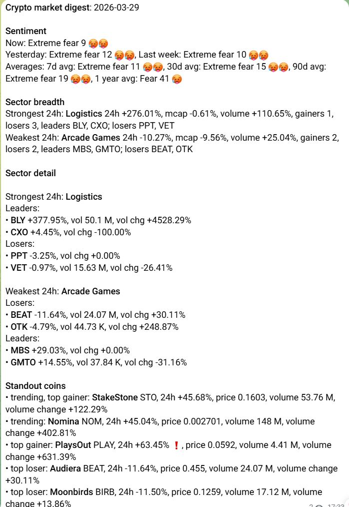

# Example Messages

## Stocks

Historical stock screenshots were removed from the backend repo.
Keep new stock delivery examples in workspace docs if they are worth preserving as durable evidence.

## Crypto

The current crypto notification flow sends a single digest-oriented message.

### Current digest layout

The older repo-local crypto screenshots no longer match the live crypto job shape after the digest refactor and should be reviewed separately before being kept as historical examples.
