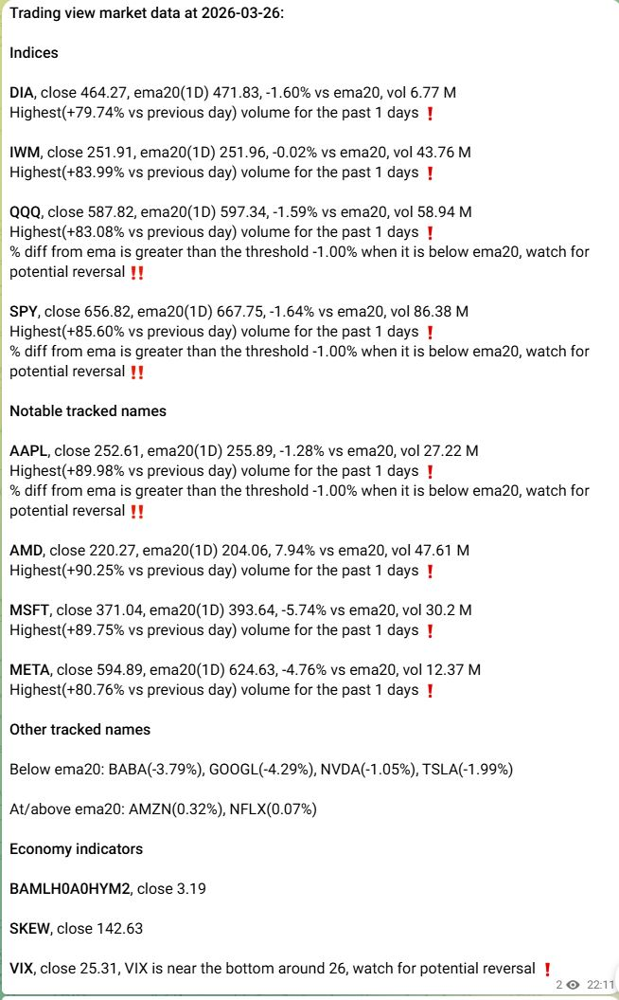
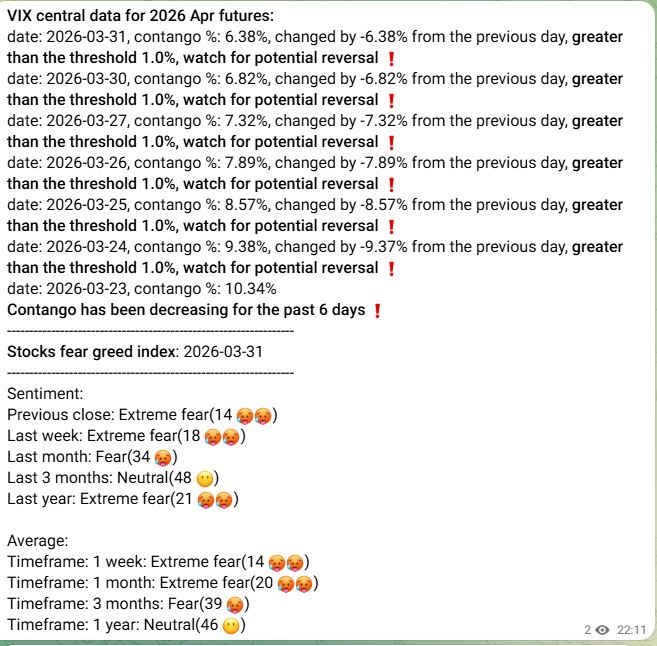
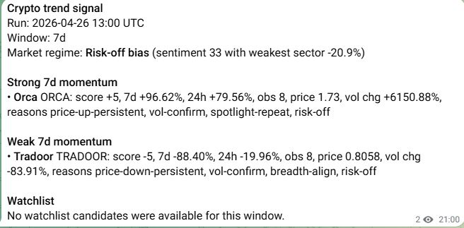
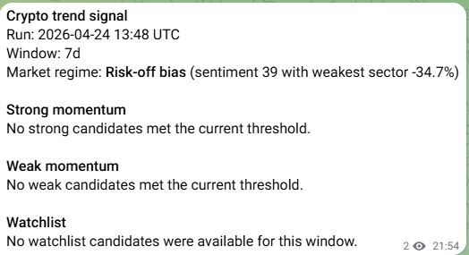

# Example Messages

## Stocks

The current stocks notification flow sends a two-message digest-oriented layout.

### Current digest layout

Older repo-local stock screenshots were removed because they no longer matched the accepted digest shape.

## Crypto

The current crypto notification flow sends a single digest-oriented message.

### Current digest layout

The older repo-local crypto screenshots no longer match the live crypto job shape after the digest refactor and should be reviewed separately before being kept as historical examples.

## Crypto Signal

The phase-1 crypto signal flow sends a separate private/admin operator message
from stored SQLite history. The public crypto digest remains unchanged.

### Candidate output

### No-candidate output

